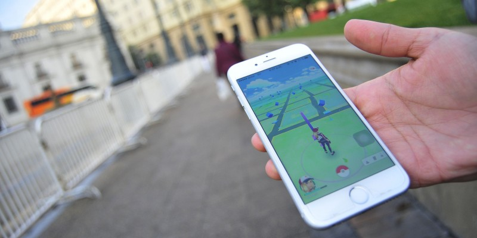
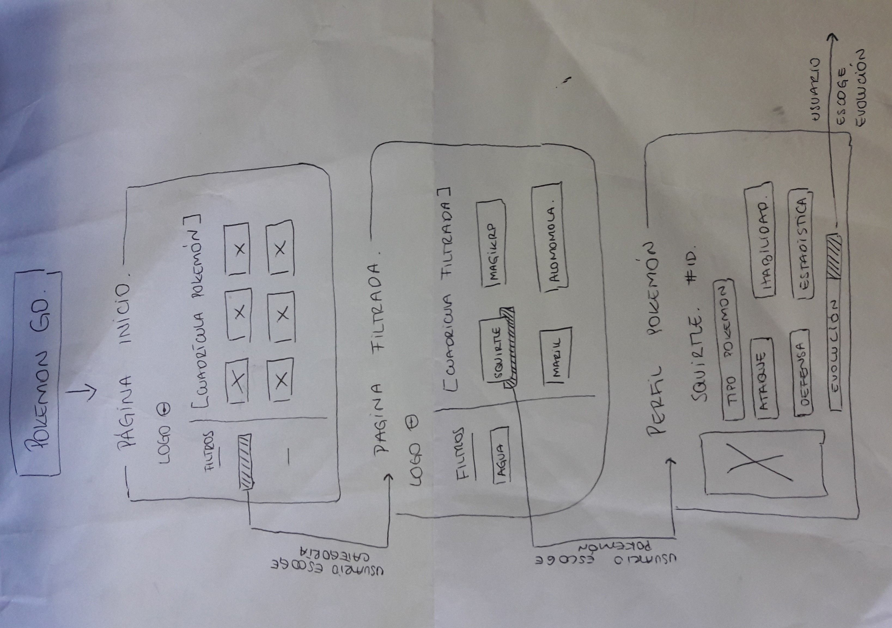
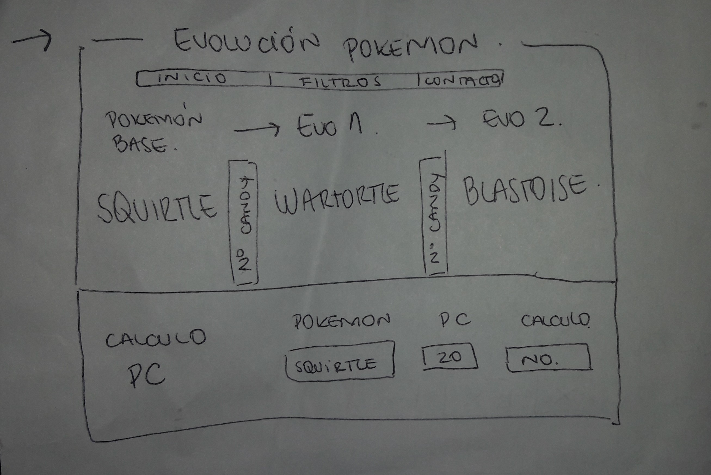
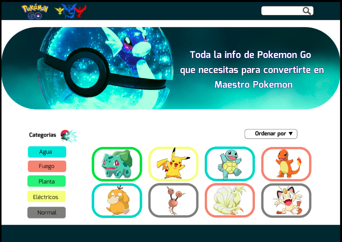
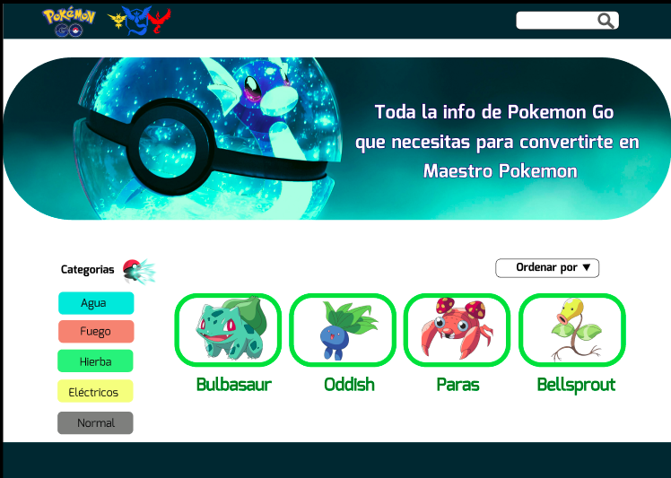
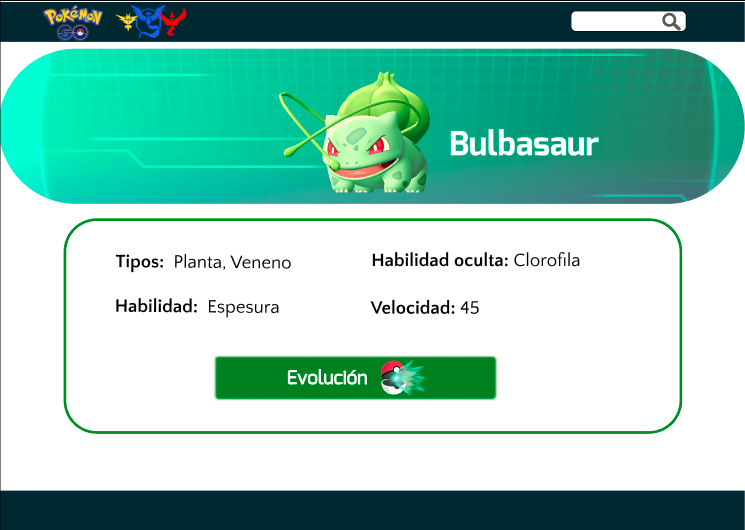
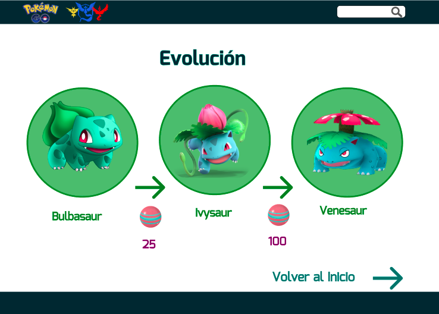

# Pokémon GO

PokeInfo es una aplicación que brinda ayuda a personas que están comenzando a jugar PokémonGO y visualizar la información sobre los pokémones como el perfil y las evoluciones.

* El usuario puede seleccionar la categoría que desee y así poder revisar los pokémones de la categoría que haya seleccionado.

* En el momento que el usuario seleccione un pokemon le aparecerá la información de este pokémon, también ver las evoluciones y ver la cantidad de caramelos que debe juntar para poder evolucionar a su pokemon.

* También está la opción para ordenar los nombres de los pokémones alfabéticamenta.

## Historias de usuarios
***

Preguntas: 
1.-¿Que datos son los mas importantes como en los pokémones? ( habilidades, ataque, etc.) 

2.-¿Cuales crees tu que son los objetivos o propósitos del juego?

3.-¿Cual es según tú la información más importante que debe saber o conocer un jugador principiante?

Jugador 1: Carlos 

1.-  En los Pokémon: 

* PC del Pokémon, cantidad de poder que tienen el Pokémon 
* La cantidad de caramelos que se requieren para evolucionar al Pokémon 
* De  qué tipo es (fantasma, bicho, normal, etc)

2.- El objetivo principal es entretener a los entrenadores Pokémon, que realicen una actividad física a través de la caminata y conocer diversos lugares. 

3.- Cómo capturar un Pokémon, de que sirve el polvo mágico y los caramelos, la utilización de frutas, principalmente las piñas que doblan los caramelos, que se deben realizar misiones diarias y misiones de los eventos y por último como se participa una incursión.

Jugador 2: Oriel

1.- Lo más importante en un Pokémon son sus PC(puntos de combate), Su IV(Nivel de pureza) y sus habilidades las cuales sean potenciadas por el tipo de Pokémon, básicamente el juego se reduce a números

2.- El objetivo del juego, básicamente es recrear la idea de una serie que todos los jugadores veían cuando niños, ya que una gran parte de los q juegan son de los nacidos en el 90, finalmente la idea principal es elegir un equipo de los cuales hay tres instinto, sabiduría y valor y enfrentar gimnasios los cuales estan en diferentes partes y así sube el nivel del entrenador.

3.- Y si me preguntas por consejos de juego, diría q analizaran bien el tipo de equipo Pokémon q quieren formar, de manera q todo su equipo se potencie con las habilidades de sus otros Pokémon.

Jugador 3: Yolanda

1.- Los puntos de salud que es como la vida del pokemon, hay de 90 hasta de 3000 y mientras mas puntos de salud mas dura en cambate lo otro son los puntos de combate que es cuanto poder tiene el pokemon para peliar y cuanto daño le hace al otro pokemon y eso puede ser de 10 hasta como 200, El pokemos ideal es el que tiene salud alta y combate alto.

2.- solo divertirse

3.- ninguna en particular solo ir siguiendo las instrucciones es super facil jugar no necesitar saber nada de información extra de la serie o algo asi

Jugador 4: Maitane

1.- Los datos mas importantes son el tipo del pókemon y su IV, no te sirve de nada competir con un pókemon de un tipo en ventaja si su IV es malo y viceversa

2.- Completar la pokedex, conseguir pókemon de buen IV y atrapar shinies (variocolor)

3.- Estrategias para colocar pókemon en gimnasios, si hay un pókemon tipo fuego antes que ti, te conviene colocar algo que sea fuerte contra agua, porque el que ataque va a venir atacando con uno de agua probablemente. Ahora que se habilitaron las batallas PVP, también es bueno conocer los pókemon que son fuertes contra otros y tratar de no usar pókemon con debilidad x4.

Jugador 5: Nicolás

1.- Los datos importantes en un pokemon, son los PC(Puntos de combate) que determinan los puntos de habilidad que tiene este pokemon... entre más PC tenga, mejor peleará el pokemon.
Cabe destacar que si uno captura un pikachu, no todos los pikachu tienen la misma habilidad, habrán pikachu que tendrán más salud que otro, más ataque o más defensa.
Cómo tambien, habrán pikachu que tendrán mejora en ambas cualidades o en todas.

2.- El objetivo del juego, para algunos es capturar todos los pokemones y para otros capturar a los más fuertes, ambas son validas.

3.- Y cual es la mayor información que debe conocer un novato... primordial subir de nivel antes de ir capturando y mejorando tus pokémones.
Ha medida que vayas subiendo nivel a tu entrenador, saldrán pokemones más fuertes, por ende si tu objetivo es tener pokémones fuertes, la recomendacion es guardar todos los polvos estelares que vayas acumulando para poder usarlos cuando captures un pokémon de nivel 35 hacia delante (40 nivel máximo)
Para que así no uses polvos estelares en mejorar pokémones de nivel bajo y usarlos para mejorar pokémones de nivel 35 hacia delante, lo digo por que los polvos estelares es el elemento más escaso para mejorar pokémones. Las personas que lo usan en niveles bajos, se quedan despues sin polvos estelares para mejorar sus pokémones fuertes.

## Flujo

Una vez ya teniendo claro el usuario a quien estará dirigida la aplicación, desarrollamos el flujo del recorrido que hará el usuario:

* Se entra a la pagina.
* Encuentra las categorías y se muestra una galeria de los pokémones.
* Luego al seleccionar la categoría, le mostrara los pokémones de dicha categoría.
* Al seleccionar un pokémon, mostrara el perfil de este pokémon
* Y el ultimo paso sera ver la evolución de este pokémon y la cantidad de caramelos que necesita para poder evolucionar.

## Diseño interfaz de usuario

Luego de hacer nuestras historias de usuario, diseñamos nuestro prototipo en Figma:

En la primera pagina se encuentra los de pokemon go y de los diferentes equipos, también una pequeña descripción, un filtro para ordenar alfabéticamente, las categorías y una pequeña muestra de los tipos de pokémones y al seleccionar una categoría los enviara a la segunda pagina.

La segunda pagina muestra los pokémones de la categoría seleccionada, en este caso es la categoría tipo planta y hay puedo seleccionar al pokémon que deseo ver el perfil.

En la tercera pagina muestra el perfil del pokémon y me en seña que tipo de pokémon es, la habilidad, la habilidad oculta, la velocidad y tiene la opción de ver la evolución.

En la cuarta pagina muestra la evolución del pokeḿon y la cantidad de caramelos que se necesita para evolucionar a el pokémon y da la opción de "Volver al inicio" y así regresar a la primera pagina.

